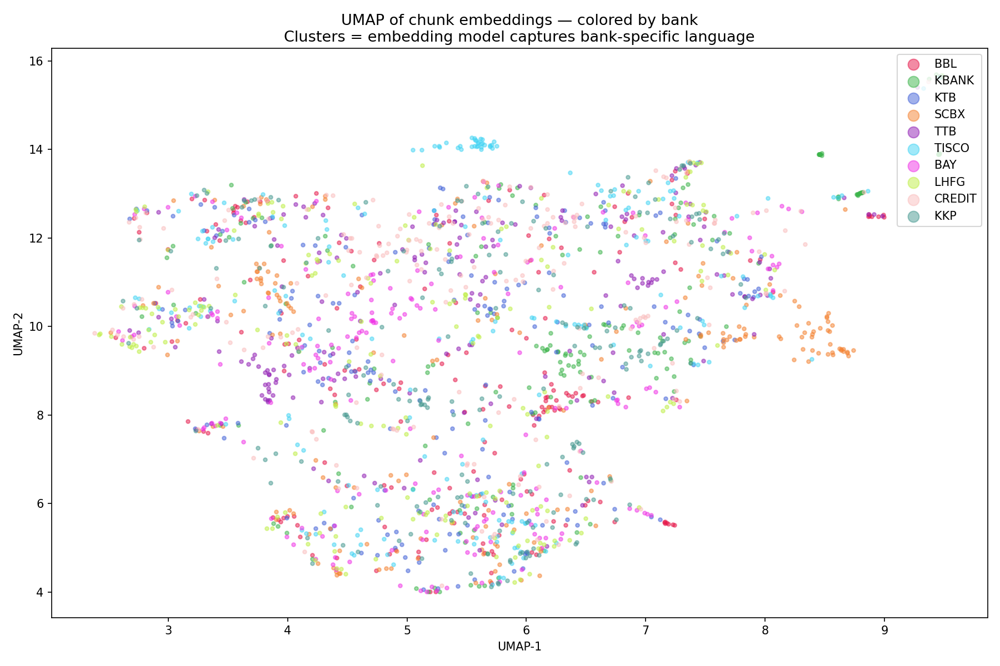

# Thai Bank Financial Q&A System

A RAG-based (Retrieval-Augmented Generation) system that answers natural language questions about Thai commercial banks using their FY2025 56-1 One Report annual filings. Built as a portfolio project for a Data Scientist role in financial services.

---

## What You Can Ask

**Single-bank questions**

    "What was KBANK's net interest margin in 2025?"
    "What was TTB's CET1 capital ratio at end of 2025?"
    "How much was TISCO's ROE in 2025?"

**Cross-bank comparisons**

    "Which bank had the highest NPL ratio in 2025?"
    "Which bank reported the lowest cost-to-income ratio?"
    "Compare BBL and KBANK's ROE — which was higher and by how much?"

**Year-over-year trends**

    "Did KTB's NIM improve or decline from 2024 to 2025?"
    "How did BAY's NPL ratio change year-over-year?"

**Regulatory and strategic themes**

    "Which banks mentioned the BOT policy rate cut as a key risk factor?"
    "Which banks highlighted digital transformation as a strategic priority?"

---

## System Architecture

    User question
         │
         ▼
    Query router ──── single-bank? ──── metadata filter (bank_name)
         │                                      │
         └──── cross-bank? ────────────── no filter
                                               │
                                               ▼
                                     ChromaDB vector search
                                     (all-MiniLM-L6-v2, 384-d)
                                               │
                                               ▼
                                      top-k relevant chunks
                                               │
                                               ▼
                                     Gemini 1.5 Flash (LLM)
                                     + financial system prompt
                                               │
                                               ▼
                                    Answer + source bank + page ref

---

## The Story — How It Was Built

### Chapter 1 — Document Processing (NB01) ✓

Loaded FY2025 56-1 One Reports for 10 Thai commercial banks from Google Drive using PyMuPDF. Extracted text from 3,282 pages totaling 9.5 million characters. Split into overlapping chunks with three configurations (256/512/1024 chars) to test which best preserves financial table context for retrieval.

Key finding: financial ratio tables (NPL, NIM, ROE, CAR) are extracted as plain text in left-to-right order. The 512-char config keeps 4-5 related metrics together per chunk; 256-char isolates each metric, reducing topic dilution in embeddings.

| Bank | Pages | Total chars | Chunks (512/100) |
|------|-------|-------------|-----------------|
| BBL | 233 | 732K | 2,068 |
| KBANK | 180 | 1,204K | 3,399 |
| KTB | 393 | 1,316K | 3,878 |
| SCBX | 361 | 1,004K | 2,907 |
| TTB | 195 | 499K | 1,512 |
| TISCO | 364 | 899K | 2,614 |
| BAY | 487 | 1,038K | 3,006 |
| LHFG | 329 | 871K | 2,469 |
| CREDIT | 302 | 631K | 2,034 |
| KKP | 438 | 1,344K | 3,926 |
| **Total** | **3,282** | **9.5M** | **27,813** |

### Chapter 2 — Vector Database (NB02) ✓

Embedded all 27,813 chunks using `sentence-transformers/all-MiniLM-L6-v2` (384-dimensional vectors, runs locally, no API cost). Stored in ChromaDB with `bank_name`, `source_file`, `page_number`, and `chunk_index` as metadata for filtering.

UMAP visualization of 2,000 sampled embeddings reveals that chunks cluster by **financial topic** rather than by bank — NPL chunks from KTB and BBL land near each other, as do NIM chunks from all banks. This confirms: (1) cross-bank retrieval works by topic similarity, and (2) single-bank queries require metadata filtering rather than relying on embedding space alone.

Key retrieval finding: the 512-char config suffers from topic dilution — a chunk containing ROA, ROE, NIM, and cost-to-income has a diluted embedding that matches no single metric well. The 256-char config is expected to reduce this, to be confirmed with RAGAS scores in NB04.

### Chapter 3 — RAG Pipeline (NB03)

*Coming soon.*

### Chapter 4 — Evaluation + MLflow (NB04)

*Coming soon — RAGAS scores will be reported here.*

| Config | Faithfulness | Answer Relevancy | Context Precision | Context Recall |
|--------|-------------|-----------------|-------------------|----------------|
| chunk=256, top_k=5 | TBD | TBD | TBD | TBD |
| chunk=512, top_k=5 | TBD | TBD | TBD | TBD |
| chunk=1024, top_k=5 | TBD | TBD | TBD | TBD |

### Chapter 5 — Demo App

*Coming soon — Streamlit screenshots will appear here.*

---

## Tech Stack

| Component | Tool |
|-----------|------|
| LLM | Gemini 1.5 Flash (Google AI Studio, free tier) |
| Embeddings | sentence-transformers/all-MiniLM-L6-v2 (local, free) |
| Vector DB | ChromaDB |
| RAG Framework | LangChain |
| Evaluation | RAGAS |
| Experiment Tracking | MLflow |
| Demo UI | Streamlit |
| PDF Extraction | PyMuPDF (fitz) |
| Runtime | Google Colab (Python 3.12) |

---

## Dataset

10 FY2025 56-1 One Reports (Thai SEC annual registration statements) from:
BBL, KBANK, KTB, SCBX, TTB, TISCO, BAY, LHFG, CREDIT, KKP

PDFs are not stored in this repo (200MB+). Download from each bank's investor relations page and place in `data/raw/` following the naming convention `{BANK}_56-1_2025.pdf`.

---

## Evaluation Design

25 questions defined **before** building the pipeline to prevent data leakage:
- 15 validation questions (V01-V15): used freely to tune chunk size, top-k, and prompt
- 10 test questions (T01-T10): run **once only** in NB04 for final reported scores

Question types: single_bank (easy/medium), cross_bank (hard), trend (medium), regulatory (hard)

---

## Author

Suparuek Wattananupan
suparuek2405@gmail.com
